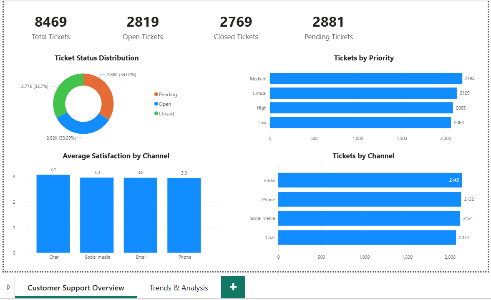
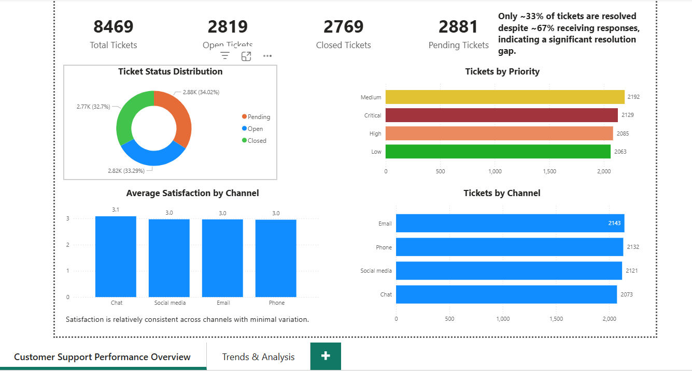

# 📊 Customer Support Dashboard (Power BI)

## 📌 Project Overview

This project analyzes customer support ticket data to evaluate operational efficiency, identify trends, and improve customer experience through data-driven insights.

## 🎯 Business Objectives

* Analyze ticket volume trends over time
* Identify inefficiencies in resolution time across priorities
* Evaluate customer satisfaction across support channels
* Provide actionable insights to improve support performance

## 📁 Dataset

* 8469 customer support tickets
* Includes ticket priority, channel, resolution time, and satisfaction ratings

## 📊 Key KPIs

* Total Tickets
* Open vs Closed Tickets
* Ticket Volume Trend
* Avg Resolution Time (Minutes)
* Avg Customer Satisfaction

## 📈 Key Insights

* Ticket volume fluctuates over time without a consistent upward or downward trend
* High priority tickets take the longest to resolve (~484 minutes), indicating inefficiency in handling urgent cases
* Critical tickets are resolved faster than high priority, suggesting potential prioritization gaps
* Customer satisfaction remains stable (~3.0), with Chat channel slightly outperforming others

## 🧠 Skills Demonstrated

* Data cleaning and transformation
* Data modeling in Power BI
* DAX for KPI calculations
* Dashboard design and storytelling
* Business insight generation

## 🖼️ Dashboard Preview

### 🔹 Customer Support Overview

### 🔹 Trends & Analysis

## 🚀 Tools Used

* Power BI
* SQL
* MySQL

## 📌 Author

Raghavendra Jagirdar
